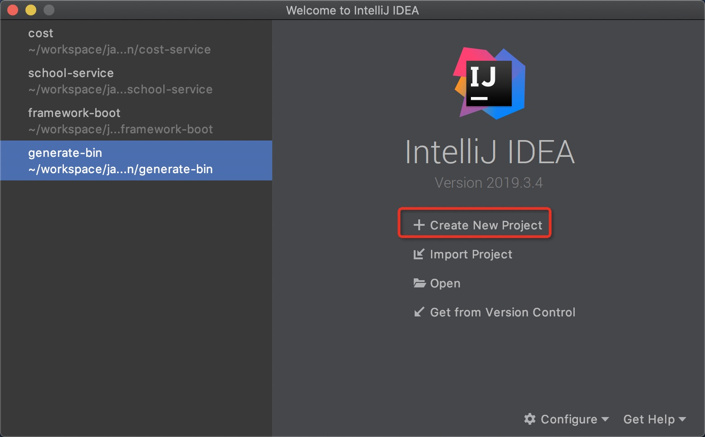
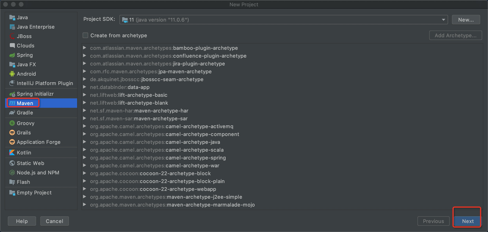
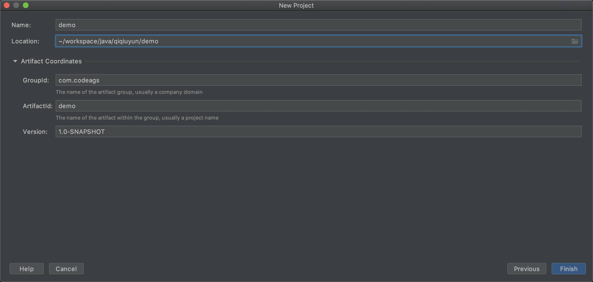
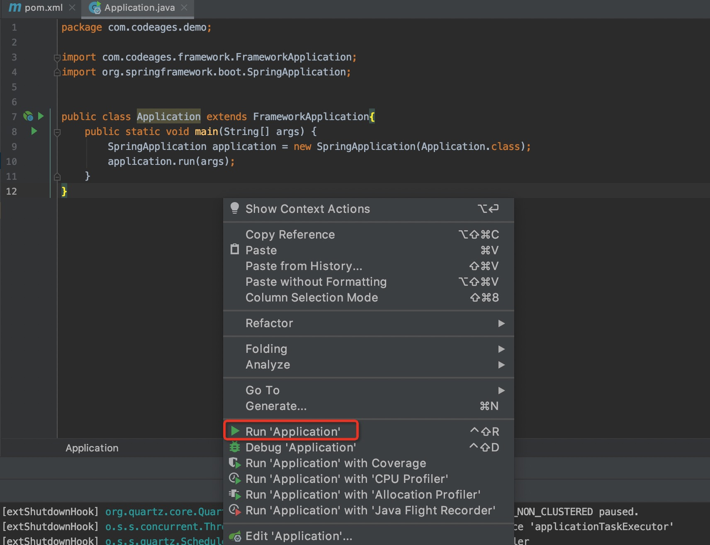

# 创建项目

### 创建maven项目

Create New Project -> Maven -> Next -> Finish





### 修改pom.xml

* 继承framework-boot脚手架
* 核心类库framework、测试类库test-framework、打包构建的工具集都在framework-boot已经申明


```
<project xmlns="http://maven.apache.org/POM/4.0.0" xmlns:xsi="http://www.w3.org/2001/XMLSchema-instance"
	xsi:schemaLocation="http://maven.apache.org/POM/4.0.0 http://maven.apache.org/xsd/maven-4.0.0.xsd">
	
	<modelVersion>4.0.0</modelVersion>
	<groupId>com.codeages</groupId>
	<artifactId>demo</artifactId>
	<version>0.0.1-SNAPSHOT</version>
	<packaging>jar</packaging>

	<properties>
		<!-- 项目的启动类 -->
		<start-class>com.codeages.demo.Application</start-class>
	</properties>

	<!-- 继承framework-boot脚手架 -->
	<parent>
		<groupId>com.codeages</groupId>
		<artifactId>framework-boot</artifactId>
		<version>0.0.1-SNAPSHOT</version>
	</parent>

	<dependencies>

		<!-- 依赖脚手架core类库 -->
		<dependency>
			<groupId>com.codeages</groupId>
			<artifactId>framework</artifactId>
		</dependency>

		<!-- 依赖脚手架test类库 -->
		<dependency>
			<groupId>com.codeages</groupId>
			<artifactId>test-framework</artifactId>
		</dependency>
	</dependencies>

	<!-- 指定framework-boot脚手架的快照地址 -->
	<repositories>
		<repository>
			<id>snapshots</id>
			<name>snapshots</name>
			<url>https://oss.sonatype.org/content/repositories/snapshots/</url>
			<snapshots>
				<enabled>true</enabled>
			</snapshots>
		</repository>
	</repositories>

	<!-- 引入打包构建的工具集 -->
	<build>
		<finalName>demo</finalName>
		<plugins>
			<plugin>
				<groupId>org.apache.maven.plugins</groupId>
				<artifactId>maven-dependency-plugin</artifactId>
			</plugin>
			<plugin>
				<groupId>org.apache.maven.plugins</groupId>
				<artifactId>maven-surefire-plugin</artifactId>
			</plugin>
			<plugin>
				<groupId>org.apache.maven.plugins</groupId>
				<artifactId>maven-jar-plugin</artifactId>
			</plugin>
			<plugin>
				<groupId>com.codeages</groupId>
				<artifactId>generate-bin</artifactId>
			</plugin>
			<plugin>
				<groupId>org.apache.maven.plugins</groupId>
				<artifactId>maven-antrun-plugin</artifactId>
			</plugin>
		</plugins>
	</build>
</project>
```

### 创建启动类

* FrameworkApplication类来自于脚手架

```
package com.codeages.demo;

import com.codeages.framework.FrameworkApplication;
import org.springframework.boot.SpringApplication;


public class Application extends FrameworkApplication{
	public static void main(String[] args) {
		SpringApplication application = new SpringApplication(Application.class);
		application.run(args);
	}
}
```

### 创建配置文件

* 创建配置的模板文件application-dev.properties.dist

```
cd demo 
touch src/main/resources/application-dev.properties.dist

文件内容如下：

spring.datasource.url = jdbc:mysql://127.0.0.1/demo
spring.datasource.username = root
spring.datasource.password = root
```

* 创建开发环境下加载的配置文件application-dev.properties

```
cd demo
cp src/main/resources/application-dev.properties.dist src/main/resources/application-dev.properties
```

### 创建数据库

```
create database demo;
```

### 创建.gitignore

```
cd demo
touch .gitignore

文件内容如下：

.DS_Store
/target
/logs
/work
.idea
```

### 启动程序



### 访问测试

```
http://localhost:8080/actuator
```

### 约定

* 项目中所有的生产环境下用到的类都以【com.codeages.项目名】为根包
* 项目中所有的测试环境下用到的类都以【test.codeages.项目名】为根包


