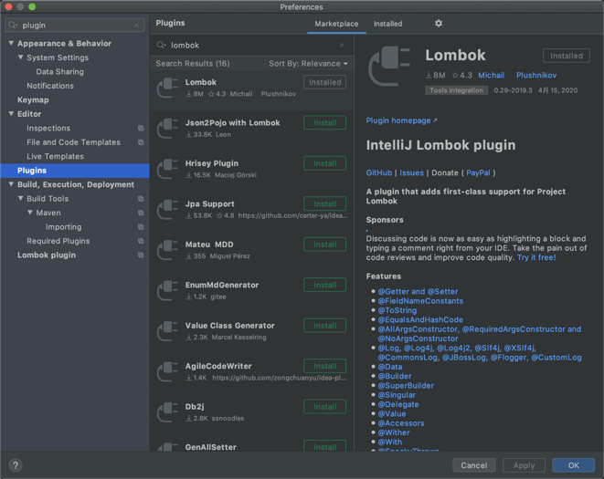
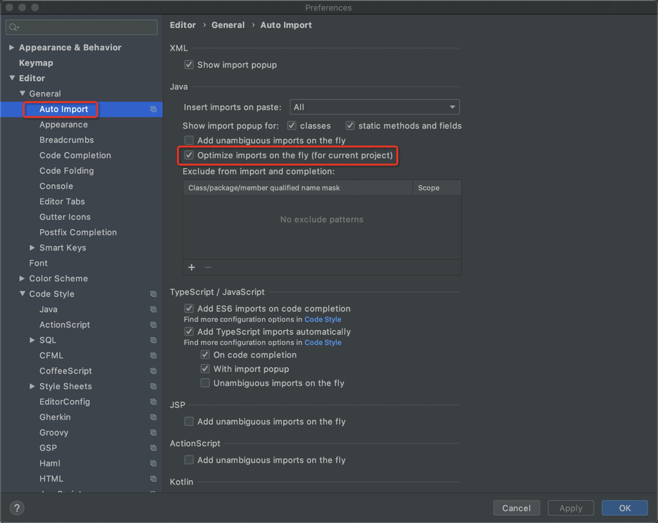

# IDEA安装及设置

### 下载IntelliJ IDEA

下载IDEA -> 安装

```
下载地址：https://www.jetbrains.com/idea/
```

### 安装Lombok插件

启动IDEA -> preferences -> Plugins -> 搜索：lombok -> install -> 重启IDEA




### 设置优化

* 设置自动去除无用的import语句： preferences -> Editor -> General -> Auto Import

